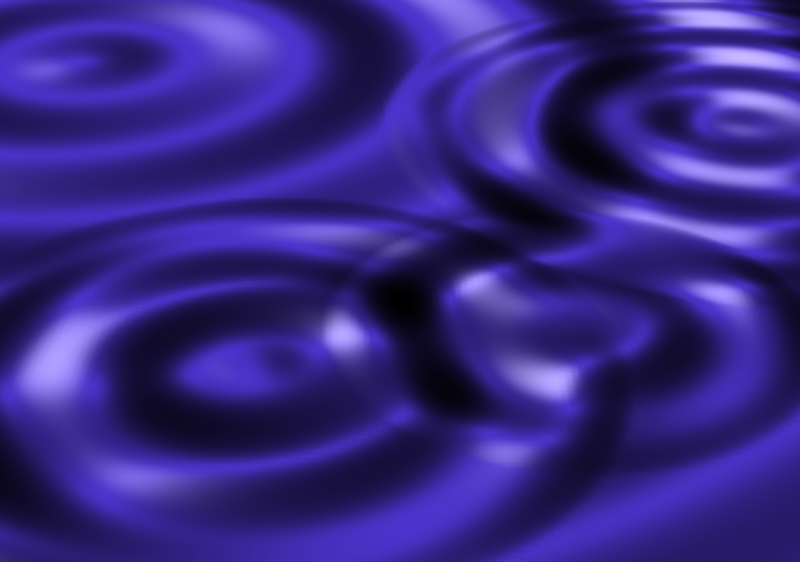

Click on screen to create ripples! Longer clicks apply more force.

This is a little bit more than trivial WebGL project. Browser code is written in TypeScript and npm is used for build process.

To build, run in project folder:
`$npm run build`

To run, open `target/index.html` in your browser of choice. You will need script support.

License: MIT

